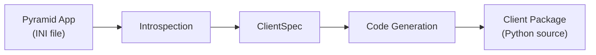

# pyramid-client-builder

Introspect a [Pyramid](https://trypyramid.com/) application and generate a typed HTTP client package — like `protoc` for gRPC, but for your Pyramid REST API.

## How it works

`pyramid-client-builder` reads your Pyramid app's route and view configuration at runtime, extracts endpoint metadata (paths, methods, parameters, Marshmallow schemas), and produces a standalone Python client package.



Each layer is independent:

- **Introspection** boots the app and reads the route registry — no code generation happens here.
- **ClientSpec** is a plain data structure describing all endpoints and schemas — it can be built manually for testing.
- **Code Generation** reads a ClientSpec and renders Jinja2 templates — it never touches Pyramid.

## What you get

Running `pclient-build` produces a Python package with:

- **`client.py`** — an HTTP client class with one method per endpoint, using `requests` for transport
- **`schemas.py`** — copies of your server's Marshmallow schemas for request/response serialization
- **`ext.py`** — a Pyramid `includeme` that registers the client on `request` (e.g., `request.payments_client`)
- **Per-version subdirectories** — when your API has versioned paths (`/api/v1/...`), each version gets its own client and schemas

## Quick start

```bash
pip install pyramid-client-builder

pclient-build development.ini --name payments --output ./generated/
```

```python
from payments_client.client import PaymentsClient

client = PaymentsClient(base_url="http://localhost:6543")
charges = client.list_charges()
```

See [Getting Started](getting-started.md) for a full walkthrough.

## Features at a glance

- **Natural method names** — `/charges/{id}/cancel` becomes `cancel_charge()`, not `create_charge_cancel()`
- **Schema serialization** — request bodies are serialized with `schema.dump()`, responses deserialized with `schema.load()`
- **API versioning** — versioned paths produce sub-clients: `client.v1.list_charges()`
- **Include/exclude filtering** — generate only the endpoints you need with glob patterns
- **Cornice + pycornmarsh** — supports both Cornice schema patterns out of the box
- **Deterministic** — same inputs always produce identical output
