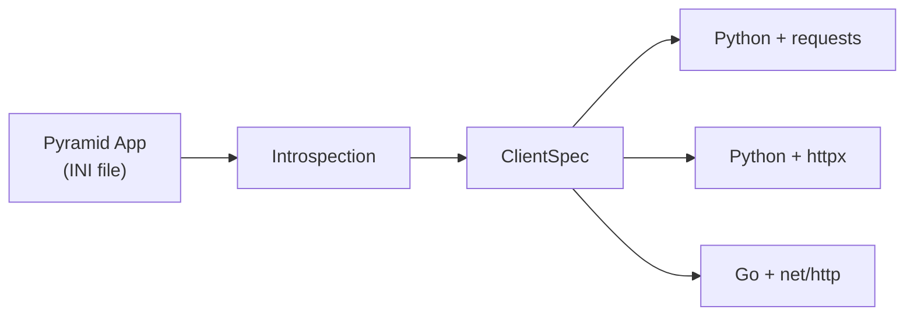

# pyramid-client-builder

Introspect a [Pyramid](https://trypyramid.com/) application and generate typed HTTP clients — like `protoc` for gRPC, but for your Pyramid REST API. Generates Python and Go clients in a single invocation.

## How it works

`pyramid-client-builder` reads your Pyramid app's route and view configuration at runtime, extracts endpoint metadata (paths, methods, parameters, Marshmallow schemas), and produces client packages for multiple languages and HTTP transports.



Each layer is independent:

- **Introspection** boots the app and reads the route registry — no code generation happens here.
- **ClientSpec** is a plain data structure describing all endpoints and schemas — it can be built manually for testing.
- **Code Generation** reads a ClientSpec and renders Jinja2 templates — it never touches Pyramid. Multiple generators consume the same spec independently.

## What you get

Running `pclient-build` produces three client variants in subdirectories:

- **`python_requests/`** — Python package using `requests` for HTTP transport
- **`python_httpx/`** — Python package using `httpx` for HTTP transport
- **`go/`** — Go module using `net/http` (standard library only, no third-party deps)

Each Python variant includes:

- **`client.py`** — an HTTP client class with one method per endpoint
- **`schemas.py`** — copies of your server's Marshmallow schemas for request/response serialization
- **`ext.py`** — a Pyramid `includeme` that registers the client on `request`
- **Per-version subdirectories** — when your API has versioned paths

The Go variant includes:

- **`client.go`** — a Client struct with functional options and one method per endpoint
- **`types.go`** — Go structs generated from your Marshmallow schemas with JSON tags
- **`go.mod`** — Go module definition
- **Per-version sub-packages** — when your API has versioned paths

## Quick start

```bash
pip install pyramid-client-builder

pclient-build development.ini --name payments --output ./generated/
```

```python
from payments_client.client import PaymentsClient

client = PaymentsClient(base_url="http://localhost:6543")
charges = client.list_charges()
```

```go
import "payments-client"

client := paymentsclient.NewClient("http://localhost:6543")
charges, err := client.V1.ListCharges(nil)
```

See [Getting Started](getting-started.md) for a full walkthrough.

## Features at a glance

- **Multi-language** — Python (requests + httpx) and Go clients from a single invocation
- **Natural method names** — `/charges/{id}/cancel` becomes `cancel_charge()` (Python) or `CancelCharge()` (Go)
- **Schema serialization** — Marshmallow schemas become Python schema classes or Go structs with JSON tags
- **API versioning** — versioned paths produce sub-clients: `client.v1.list_charges()` or `client.V1.ListCharges()`
- **Include/exclude filtering** — generate only the endpoints you need with glob patterns
- **Cornice + pycornmarsh** — supports both Cornice schema patterns out of the box
- **Deterministic** — same inputs always produce identical output
- **Standard library Go** — the Go client uses only `net/http` and `encoding/json`, no third-party dependencies
